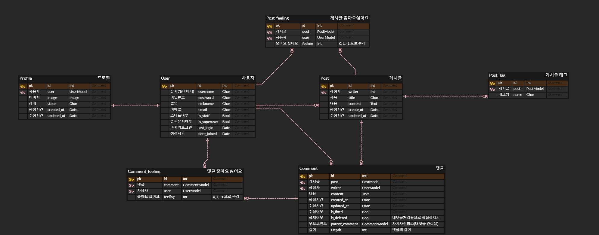

# Tech Blog 만들기

## 개발 목표

작성중입니다.

## 개발환경 및 개발 기간

-   개발환경  
    Django4.2.3, HTML, CSS, JavaScript, sqlite

-   HTML, CSS 기반  
    [기반 레포](https://github.com/weniv/react-blog)

-   개발기간  
    2023년 7일 17일 ~ 2023년 7월 20일

## 구현된 기능
1. User : 회원가입, 로그인, 로그아웃, 회원탈퇴, 비밀번호변경
2. Profile : 사진, 상태를 프로필로 생성, 프로필 수정 기능
3. Post : 게시글 CRUD, 삭제된 게시글이나 User에 대해서 다른 화면으로 redirect
4. Comment : 게시글의 댓글의 작성, 삭제와 대댓글 기능.
5. Like : 게시글과 댓글에 대한 좋아요 기능.
6. Search : 카테고리에 대한 검색기능, 생성시간순, 생성시간역순으로 정렬기능
7. Pagination: Post에 대한 간단한 페이지네이션.

## 모델


## URL

```python
### 공용 페이지
'' : 인덱스 페이지
'error/' : 에러 페이지
### 블로그
'blog/' : 블로그 리스트 페이지 및 검색 페이지
### 게시물
'blog/<int:post_id>/' : 게시글 상세정보 페이지
'blog/edit/<int:post_id>/' : 게시글 수정 페이지
'blog/delete/<int:post_id>/' : 게시글 삭제 view
'blog/<int:post_id>/like/' : 게시글 좋아요 view
### 댓글
'blog/<int:post_id>/comment/write/' : 댓글 작성 view
'blog/comment/delete/<int:comment_id>' : 댓글 삭제 view
'blog/<int:post_id>/<int:comment_id>/like/' : 댓글 좋아요 view
### 회원
'user/register/' : 회원가입 페이지
'user/login/' : 로그인 페이지
'user/logout/' : 로그아웃 view
'user/password/change/' : 비밀번호 변경 페이지
'user/delete/' : 회원탈퇴 페이지
'user/profile/<int:user_id>' : 프로필 페이지
'user/profile/update/' : 프로필 업데이트 view
```

## 세부 기능


블로그의 리스트 페이지 입니다.  
- 로그아웃시 header에 로그인과 회원가입창이 표시됩니다. 이미 로그인 된 유저가 로그인창과 회원가입창에 접근하려고 하면, 이 페이지로 자동으로 연결됩니다.
<br/><br/>


회원가입 페이지입니다.  
- 회원가입 페이지는 Django의 django.contrib.auth.forms의 UserCreationForm을 상속받아서 구현하였으며, 각 라인에 대한 에러를 표기해주도록 하였습니다.
<br/><br/>


로그인 페이지입니다.  
- 로그인 페이지는 회원가입 페이지와 유사하게 Django의 django.contrib.auth.forms의 AuthenticationForm을 상속받아서 구현하였으며, 인증에 실패할시 에러를 하단에 표기하도록 하였습니다.
<br/><br/>


로그인 된 블로그 리스트 페이지는 위와 같습니다.

- 1번 항목은 로그인된 사용자가 지정한 프로필이미지가 표시되고, 클릭시 프로필 수정페이지로 연결됩니다.  
- 1번 항목의 옆은 게시글 작성 버튼으로, 클릭시 게시글 작성페이지로 연결됩니다.
- 2번 항목은 배너 배경입니다. 매 페이지 로딩시 지정된 7개의 배경중 하나가 랜덤으로 표시됩니다.
- 3번 항목은 타이틀로 페이지에 따라서 Django에서 값을 받아서 바뀌고, 검색시에 현재 카테고리를 나타내는 역할도 겸합니다.
- 4번 항목은 카테고리 검색 및 정렬 기능으로, 카테고리를 선택하면 해당 카테고리만 표시되고, 생성시간순, 생성시간 역순으로 정렬할 수 있습니다.
- 5번 항목은 게시글의 썸네일로, 사용자가 게시글에 작성한 이미지가 있을 경우, 가장 상단의 이미지가 썸네일로 지정되고, 없을 경우에는 랜덤한 이미지 6개중 하나가 들어갑니다.
- 6번 항목은 게시글의 프리뷰로, 카테고리, 제목, 작성자, 조회수, 작성날짜, 내용미리보기가 들어갑니다. 삭제된 게시글의 경우 화면에 표시하지 않고, 탈퇴한 유저가 작성한 게시글은 표기되지만, 작성자의 정보가 나타나지 않습니다.
- 7번 항목은 페이지를 선택하는 부분입니다.
    - 페이지네이션은 Django의 Paginator를 이용하여 구현하였습니다.  
<br/><br/>

  
- 작성된 게시글이 없을 경우에는 위와 같이 나타나고, 게시글이 없다는 부분을 클릭시, 게시글 작성페이지로 연결됩니다.
<br/><br/>


프로필 수정 페이지입니다.  
- 닉네임과 프로필이미지, 상태를 수정할 수 있습니다. 프로필 이미지는 base64로 인코딩한 후 hidden input에 담아서 전달합니다.
- 프로필 수정하기 옆의 비밀번호 변경, 회원탈퇴 버튼을 통해서 비밀번호 변경과 회원탈퇴도 가능합니다.
<br/><br/>


프로필 페이지입니다.  
- 해당하는 유저의 프로필 정보를 보여줍니다.
<br/><br/>


비밀번호 변경 페이지입니다.  
- django의 django.contrib.auth.forms의 PasswordChangeForm을 그대로 사용하였습니다.  
여기에서도 인증에 실패할시 각 항목에 대한 에러를 표기합니다.
<br/><br/>


회원삭제 페이지입니다.  
- 일반 form 에서 clean을 오버라이딩하고, django.contrib.auth.hashers의 check_password를 이용해서 검증절차를 진행하였습니다.
<br/><br/>


  
검색페이지입니다.  
- 블로그의 리스트와 거의 다른부분이 없어서 동일한 view에서 get요청 안의 category, sort, page 여부에 따라서 처리를 다르게 하도록 하였습니다.
- 현재 선택된 카테고리는 Tech Blog 식으로 위에 나타나고, 현재의 정렬방식에는 밑줄이 쳐집니다.
<br/><br/>


게시물의 상세페이지입니다.
- 작성자 이름이나 작성자의 프로필 이미지를 누르면 작성자의 프로필 페이지로 이동합니다.
    -삭제된 유저의 경우에는 삭제된 유저의 이미지와, 탈퇴한 유저입니다. 라는 텍스트를 표기합니다.
- 게시글 제목 위의 태그를 클릭하면 검색페이지로 넘어갑니다.
- 작성자 옆의 버튼으로 게시글 수정이나, 게시글 삭제동작을 수행할 수 있습니다.
- 게시글 삭제시, 간접적으로 post의 is_deleted 값을 True로 바꾸는 방식으로 처리합니다.
- 게시글의 제목과 게시글의 조회수를 표기합니다.
    - 조회수는 Post 모델안에 view_count 칼럼을 만들고, get요청이 올때마다 1씩 증가시키는 방식으로 처리합니다.
- Like 버튼은 현재 받은 Like 수와 본인이 Like 버튼을 눌렀을 시, 색상이 주황색으로, 본인이 누르지 않았을 시 흰색으로 표기됩니다.
    - like 수는 내부적으로 like_count 칼럼을 만들어서 처리하였고, 개인의 like 여부는 post_feeling 테이블을 만들어서 처리하였습니다.
    - like 버튼을 클릭했을 때, view에서 해당하는 유저와 해당하는 post의 post_feeling 이 있다면 그 값에 따라서 post의 like_count를 증감시키고, post_feeling 값을 반대로 만듭니다.
    - 해당하는 유저의 post에 대한 post_feeling가 없다면, post_feeling을 생성하고, post의 like_count를 증가시킵니다.
- 게시글의 내용은 토스트에디터에서 HTML로 보낸 값을 템플릿에서 {{ post|safe }} 플래그를 이용해서 처리합니다. 악의적인 상황을 방지하기 위해서 게시글 작성파트에서 script에 대한 처리를 합니다.
- 댓글작성창은 유저가 로그인되어 있을시에 표기됩니다.
- 댓글과 대댓글 기능
    - 대댓글기능은 댓글 모델에 parent_comment 칼럼을 만들어서 자가 참조를 하는 식으로 구현합니다.
    - 댓글의 표시는 comments.html 을 재귀적으로 호출하면서 indent 를 주도록 합니다.
        ```django
        
            
                
            
        
        ```
    - 댓글의 작성자도 게시물과 마찬가지 방법으로 처리합니다.
    - 좋아요 기능의 경우에는 게시글과 구현방법이 같습니다.
    - 댓글의 삭제버튼은 댓글의 작성자와 유저가 같은 경우에만 표기됩니다,
    - 대댓글을 작성하는 버튼은 로그인되어있을때만 표기되며, 선택시 댓글버튼 옆으로 입력창이 나타납니다.
    - 삭제된 코멘트는 내부적으로 is_delted를 True로 만들어서 처리하고, 삭제된 코멘트라고 표시합니다.
<br/><br/>


- 게시물에 이미지가 있을 경우의 표기입니다.
<br/><br/>


- is_deleted 칼럼의 값이 True인 게시글의 경우 위와 같이 표시됩니다.
<br/><br/>


- 삭제된 유저가 작성한 글의 경우에는 작성자만 다르게 표시합니다.
<br/><br/>


  
게시글 작성 페이지입니다.
- 타이틀과 카테고리, 내용을 제출할 수 있습니다.
- 카테고리는 옆의 버튼을 누르면 체크박스가 나타나고, 체크박스에 체크하면 카테고리 선택창에 표시됩니다.
- 내용 에디터는 toast editor를 사용하였고, HTML로 받은 후 hidden input 값에 넣어서 전달합니다.
    - view에서는 form에서 검증작업중에 script를 정규표현식
    ```python
        r'<script[^>]*>.*?<\/script[^>]*>', re.DOTALL
    ```
    을 통해서 공백으로 변환합니다.
<br/><br/>

  
수정페이지입니다.
- 게시글 작성 페이지와 전반적인 로직은 같습니다.
<br/><br/>


에러 페이지입니다.
- 에러 발생시에는 message에 에러 내용을 담은 후 error페이지로 redirect 하게 처리합니다.


### 세부 구현

### 개선될만한 부분? 

- 조회수가 중복되서 처리되는 부분
- 사진을 base64가아니라 직접 저장하게하는 부분
- 게시글이나 댓글의 삭제시 확인을 하지 않는 부분.
- 대댓글의 depth가 사실상 증가할 수 있는데, depth가 너무 깊어지면 레이아웃이 깨질것으로 예상됨.
- 댓글 표시의 갯수 제한.
- 댓글의 수정기능.
- 일반텍스트에 대한 검색기능이 없음.
- 클래스뷰에서의 message의 사용법이 조금 다를 수 있음.
- 페이지네이터에서 페이지 전환 버튼이 나오는 갯수에 제한을 두기
- 유저가 같은지에 대한 처리를 데코레이터를 이용해서 할수도 있을것같음.
- 검색기능에서 Q객체 이용해보기.
- lightsail을 이용해서 배포해보기.