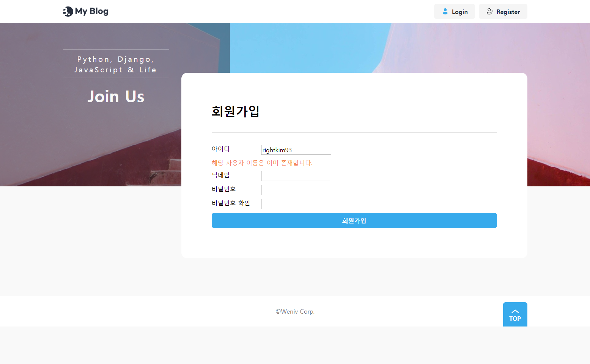
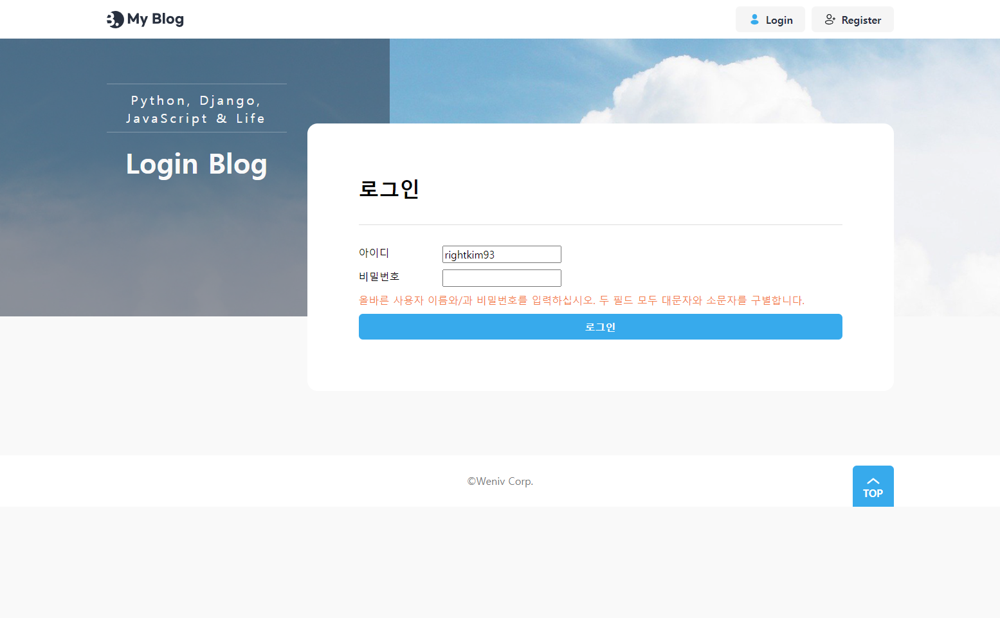
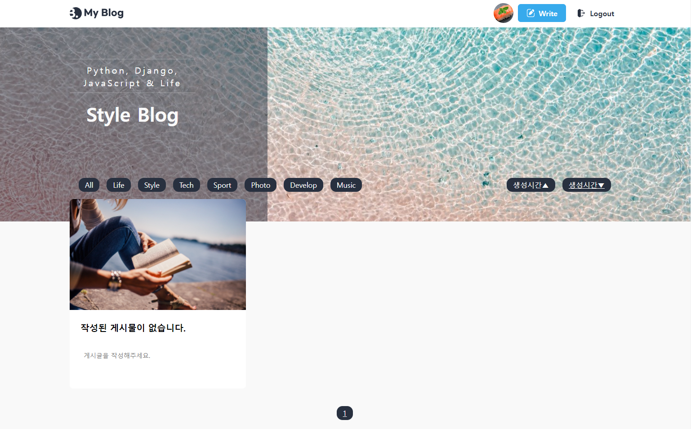
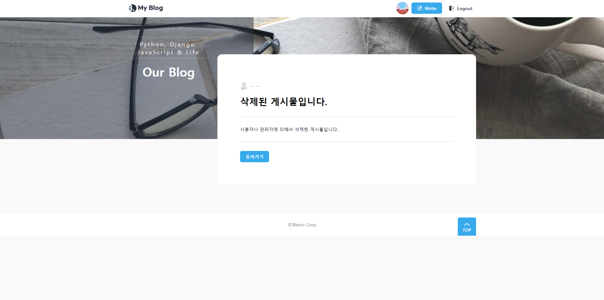
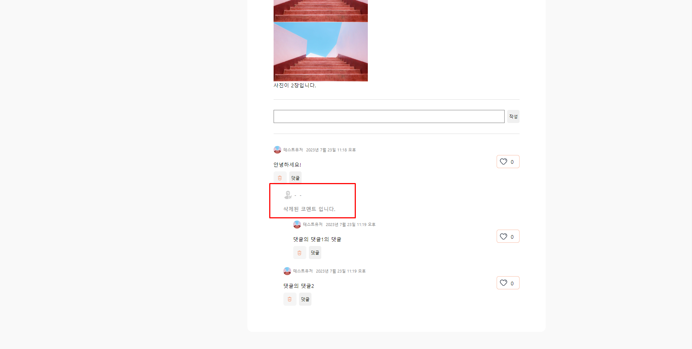
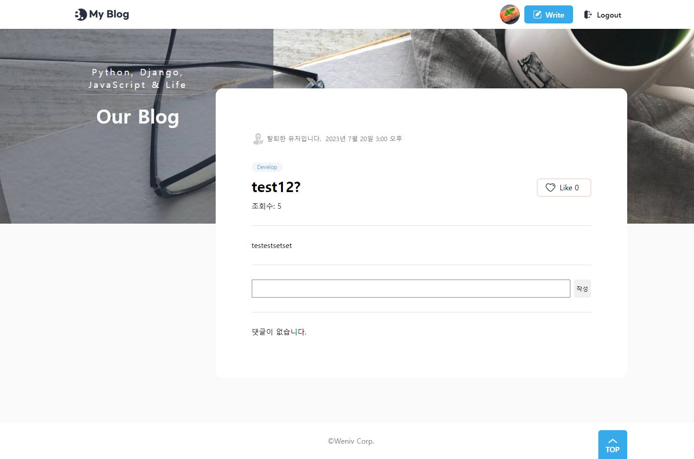

# Tech Blog 만들기

## 프로젝트 목표

다양한 주제에 대해서 포스팅 할 수 있는 회원제 블로그를 Django를 이용해서 모놀리 식으로 만들기.

## 개발환경 및 개발 기간

-   개발환경  
    Django4.2.3, python 3.11.3, HTML, CSS, JavaScript, sqlite

-   HTML, CSS 기반  
    [기반 레포](https://github.com/weniv/react-blog)를 바탕으로 수정을 가해서 제작 하였습니다.

-   개발기간  
    5일

## 배포 URL

ligthsail을 통한 배포 예정

## 구현된 기능
1. User : 회원가입, 로그인, 로그아웃, 회원탈퇴, 비밀번호변경
2. Profile : 사진, 상태를 프로필로 생성, 프로필 수정 기능
3. Post : 게시글 CRUD, 삭제된 게시글에 대한 처리, 조회수기능
4. Comment : 댓글의 작성, 삭제와 대댓글 기능.
5. Like : 게시글과 댓글에 대한 좋아요 기능.
6. Search : 카테고리에 대한 검색기능, 생성시간순, 생성시간역순 정렬 기능.
7. Pagination: Post에 대한 페이지네이션.

## 모델


## URL

```python
### 공용 페이지
'' : 인덱스 페이지
### 블로그
'blog/' : 블로그 리스트 페이지 및 검색 페이지
### 게시물
'blog/<int:post_id>/' : 게시글 상세정보 페이지
'blog/edit/<int:post_id>/' : 게시글 수정 페이지
'blog/delete/<int:post_id>/' : 게시글 삭제 view
'blog/<int:post_id>/like/' : 게시글 좋아요 view
### 댓글
'blog/<int:post_id>/comment/write/' : 댓글 작성 view
'blog/comment/delete/<int:comment_id>' : 댓글 삭제 view
'blog/<int:post_id>/<int:comment_id>/like/' : 댓글 좋아요 view
### 회원
'user/register/' : 회원가입 페이지
'user/login/' : 로그인 페이지
'user/logout/' : 로그아웃 view
'user/password/change/' : 비밀번호 변경 페이지
'user/delete/' : 회원탈퇴 페이지
'user/profile/<int:user_id>' : 프로필 페이지
'user/profile/update/' : 프로필 업데이트 view
```

## 세부 기능

### 로그아웃시 블로그의 리스트 페이지 


- 로그아웃시 header에 로그인과 회원가입창이 표시됩니다. 이미 로그인 된 유저가 로그인창과 회원가입창에 접근하려고 하면, 리스트 페이지로 연결됩니다.
<br/><br/>

### 회원가입 및 로그인 페이지


  

- 회원가입 페이지는 Django의 django.contrib.auth.forms의 UserCreationForm을 상속받아서 구현하였으며, 각 라인에 대한 에러를 표기해주도록 하였습니다.
- 로그인 페이지는 회원가입 페이지와 유사하게 Django의 django.contrib.auth.forms의 AuthenticationForm을 상속받아서 구현하였으며, 인증에 실패할시 에러를 하단에 표기하도록 하였습니다.
<br/><br/>

### 프로필 수정 페이지 및 프로필 페이지

- 닉네임과 프로필이미지, 상태를 수정할 수 있습니다. 프로필 이미지는 base64로 인코딩한 후 hidden input에 담아서 전달합니다.
- 프로필 수정하기 옆의 비밀번호 변경, 회원탈퇴 버튼을 통해서 비밀번호 변경과 회원탈퇴도 가능합니다.
<br/><br/>

### 비밀번호 변경 페이지 

- django의 django.contrib.auth.forms의 PasswordChangeForm을 그대로 사용하였습니다.  
- 인증에 실패할시 각 항목에 대한 에러를 표기합니다.
<br/><br/>

### 회원삭제 페이지  

- 일반 form 에서 clean을 오버라이딩하고, django.contrib.auth.hashers의 check_password를 이용해서 검증절차를 진행하였습니다.
<br/><br/>

### 로그인시 블로그 리스트 페이지


- 1번 항목은 로그인된 사용자가 지정한 프로필이미지가 표시되고, 클릭시 프로필 수정페이지로 연결됩니다.  
- 1번 항목의 옆은 게시글 작성 버튼으로, 클릭시 게시글 작성페이지로 연결됩니다.
- 2번 항목은 배너 배경입니다. 매 페이지 로딩시 지정된 7개의 배경중 하나가 랜덤으로 표시됩니다.
- 랜덤 배너의 구현에는 커스텀 탬플릿 심플 태그 기능을 이용하였습니다.
- 3번 항목은 타이틀로 페이지에 따라서 Django에서 값을 받아서 바뀌고, 검색시에 현재 카테고리를 나타내는 역할도 겸합니다.
- 4번 항목은 카테고리 검색 및 정렬 기능으로, 카테고리를 선택하면 해당 카테고리만 표시되고, 생성시간순, 생성시간 역순으로 정렬할 수 있습니다. 가장 최근에 생성된 게시글의 가장 위에 표시되는 것이 기본값입니다.
- 5번 항목은 게시글의 썸네일로, 사용자가 게시글에 작성한 이미지가 있을 경우, 가장 상단의 이미지가 썸네일로 지정되고, 없을 경우에는 랜덤한 이미지 6개중 하나가 들어갑니다.
- 6번 항목은 게시글의 프리뷰로, 카테고리, 제목, 작성자, 조회수, 작성날짜, 내용미리보기가 들어갑니다. 삭제된 게시글의 경우 화면에 표시하지 않고, 탈퇴한 유저가 작성한 게시글은 표기되지만, 작성자의 정보가 나타나지 않습니다.
- 7번 항목은 페이지를 선택하는 부분입니다.
<br/><br/>

  

- 작성된 게시글이 없을 경우에는 위와 같이 나타나고, 게시글이 없다는 부분을 클릭시, 게시글 작성페이지로 연결됩니다.
<br/><br/>

### 페이지네이터 기능

- Django의 paginator 객체를 이용해서 구현하였습니다.
- 해당 이미지는 시연을 위해서 페이지당 게시글을 1로 제한한 상태이며, 평소에는 6개의 게시글을 보여줍니다.
- prev, next 버튼은 각각 10페이지 전, 10페이지 후로 이동하며, 화면에 보여지는 페이지수는 최대 10개를 유지합니다.
- prev, next 버튼은 이전페이지가 있을때와 이후 페이지가 있을때만 표시되며, 10개페이지 전후로 이동할 수 없다면, 1페이지나 가장 끝 페이지로 이동합니다.
- prev, next 버튼에 할당되는 url과 표시되어야 하는 페이지의 범위는 pages.py에 커스텀 템플릿 필터를 만들어서 구현하였습니다.

### 검색페이지 

  
- 블로그의 리스트와 거의 다른부분이 없어서 동일한 view에서 get요청 안의 category, sort, page 여부에 따라서 처리를 다르게 하도록 하였습니다.
- view내에서 검색은 Q객체를 이용하여 처리하였습니다.
- 현재 선택된 카테고리는 Tech Blog 와 같은 형테로 배너에 표시되고, 현재의 정렬방식에는 밑줄이 쳐집니다.
<br/><br/>

### 게시물의 상세페이지

- 작성자 이름이나 작성자의 프로필 이미지를 누르면 작성자의 프로필 페이지로 이동합니다.
- 게시글 제목 위의 태그를 클릭하면 검색페이지로 넘어갑니다.
- 작성자 옆의 버튼으로 게시글 수정이나, 게시글 삭제동작을 수행할 수 있습니다.
- 게시글 수정 및 삭제 버튼은 게시글의 작성자와 로그인된 유저가 같을 경우에만 표시됩니다.
- 게시글의 제목과 게시글의 조회수를 표기합니다.
    - 조회수는 Post 모델안에 view_count 칼럼을 만들고, get요청이 올때마다 1씩 증가시키는 방식으로 처리합니다.
    - 조회수의 중복은 쿠키를 이용해서 쿠키내에 방문한 포스트의 id를 저장하고, 받아온 쿠키가 없거나, 쿠키값에 현재 방문한 포스트의 id가 없을 경우에만 조회수를 증가시키도록 처리하여 해결하였습니다.
- 게시글의 내용은 토스트에디터에서 HTML로 보낸 값을 템플릿에서 {{ post|safe }} 플래그를 이용해서 처리합니다. 악의적인 상황을 방지하기 위해서 게시글 작성파트에서 script에 대한 처리를 합니다.

### 댓글과 대댓글 기능

- 댓글작성창은 유저가 로그인되어 있을시에 표기됩니다.
- 댓글과 대댓글 기능
    - 대댓글기능은 댓글 모델에 parent_comment 칼럼을 만들어서 자가 참조를 하는 식으로 구현합니다.
    - 댓글의 표시는 comments.html 을 재귀적으로 호출하면서 indent 를 주도록 합니다.
        ```django
        
            
                
            
        
        ```
    - 댓글의 작성자도 게시물과 마찬가지 방법으로 처리합니다.
    - 댓글의 삭제버튼은 댓글의 작성자와 유저가 같은 경우에만 표시됩니다.
    - 대댓글을 작성하는 버튼은 로그인되어있을때만 표시되며, 선택시 댓글버튼 옆으로 입력창이 나타납니다.

### 좋아요 기능

- Like 버튼에는 현재 받은 Like 수가 표시되고, 본인이 Like 버튼을 눌렀을 시, 색상이 주황색으로, 본인이 누르지 않았을 시 흰색으로 표기됩니다.
    - like 수는 내부적으로 like_count 칼럼을 만들어서 처리하였고, 개인의 like 여부는 post_feeling 테이블을 만들어서 처리하였습니다.
    - like 버튼을 클릭했을 때, view에서 해당하는 유저와 해당하는 post의 post_feeling 이 있다면 그 값에 따라서 post의 like_count를 증감시키고, post_feeling 값을 반대로 만듭니다.
    - 해당하는 유저의 post에 대한 post_feeling가 없다면, post_feeling을 생성하고, post의 like_count를 증가시킵니다.
    - 댓글의 경우에도 모델만 다를 뿐, 처리방법은 동일합니다.
<br/><br/>

### 게시글 작성 기능

  

- 타이틀과 카테고리, 내용을 제출할 수 있습니다.
- 카테고리는 옆의 버튼을 누르면 체크박스가 나타나고, 체크박스에 체크하면 카테고리 선택창에 표시됩니다.
- 내용 에디터는 toast editor를 사용하였고, HTML로 받은 후 hidden input 값에 넣어서 전달합니다.
    - view에서는 form에서 검증작업중에 script를 정규표현식
    ```python
        r'<script[^>]*>.*?<\/script[^>]*>', re.DOTALL
    ```
    을 통해서 공백으로 변환합니다.
<br/><br/>

### 게시글 수정 기능
  
- 게시글 작성 페이지와 전반적인 로직은 같습니다.
- 게시글의 소유주를 method_decorator와 커스텀 decorator를 이용해서 확인하고, 소유주가 아닐시 404페이지로 리다이렉트합니다.
<br/><br/>

### 게시글 및 댓글의 삭제 기능

  

- 게시글과 댓글 삭제시, 간접적으로 모델의 is_deleted 값을 True로 바꾸는 방식으로 처리합니다.
- 게시글과 댓글의 소유주를 method_decorator와 커스텀 decorator를 이용해서 확인하고, 소유주가 아닐시 404페이지로 리다이렉트합니다.
- is_deleted 칼럼의 값이 True인 게시글과 댓글의 경우 위와 같이 표시됩니다.
<br/><br/>

### 삭제된 유저에 대한 처리



- 삭제된 유저가 작성한 글과 댓글의 경우에는 작성자와 프로필 이미지만 탈퇴된 유저라고 표기합니다.
<br/><br/>

### 404 에러 페이지

- 커스텀한 404페이지를 이용합니다.

## 느낀점

**작성중**

Q객체

Paginator

Decorator

Custom template tag

Cookie(조회수)

좋아요버튼 .query

배포과정.

## 개선될만한 부분? 

- ~~조회수가 중복되서 처리되는 부분~~
- 사진을 base64가아니라 직접 저장하게하는 부분 - 다른 프로젝트에서 진행.
- 게시글이나 댓글의 삭제시 확인을 하지 않는 부분. - JS 단에서 처리가 더 적절할 것 같음.
- 대댓글의 depth가 사실상 무한하게 증가할 수 있는데, depth가 너무 깊어지면 레이아웃이 망가지는 문제가 있음.
- 댓글 표시의 갯수 제한. - 재귀적으로 대댓글을 표기하고 있는데, 이 방식에서 제한을 두는것은 꽤나 제한적일 것 같음.
- ~~페이지네이터에서 페이지 전환 버튼이 나오는 갯수에 제한을 두기~~
- ~~유저가 같은지에 대한 처리를 데코레이터를 이용해서 할수도 있을것같음.~~
- ~~검색기능에서 Q객체 이용해보기.~~
- ~~404 페이지로 오류 처리, 404페이지 커스터마이징.~~
- lightsail을 이용해서 배포해보기.