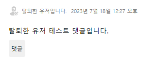

# Tech Blog 만들기

## 프로젝트 목표

다양한 주제에 대해서 포스팅 할 수 있는 회원제 블로그를 Django를 이용해서 모놀리 식으로 만들기.

## 개발환경 및 개발 기간

-   개발환경  
    Django4.2.3, python 3.11.3, HTML, CSS, JavaScript, sqlite

-   HTML, CSS 기반  
    [기반 레포](https://github.com/weniv/react-blog)를 바탕으로 수정을 가해서 제작 하였습니다.

-   개발기간  
    5일

## 배포

- [배포 URL](http://52.78.130.1/)
- 배포기반 : lightsail(ubuntu/22.04), uwsgi/2.0.21, nginx/1.18.0

## 구현된 기능
1. User : 회원가입, 로그인, 로그아웃, 회원탈퇴, 비밀번호변경
2. Profile : 사진, 상태를 프로필로 생성, 프로필 수정 기능
3. Post : 게시글 CRUD, 삭제된 게시글에 대한 처리, 조회수기능
4. Comment : 댓글의 작성, 삭제와 대댓글 기능.
5. Like : 게시글과 댓글에 대한 좋아요 기능.
6. Search : 카테고리에 대한 검색기능, 생성시간순, 생성시간역순 정렬 기능.
7. Pagination: Post에 대한 페이지네이션.

## 모델


## URL

```python
### 공용 페이지
'' : 인덱스 페이지
### 블로그
'blog/' : 블로그 리스트 페이지 및 검색 페이지
### 게시물
'blog/<int:post_id>/' : 게시글 상세정보 페이지
'blog/edit/<int:post_id>/' : 게시글 수정 페이지
'blog/delete/<int:post_id>/' : 게시글 삭제 view
'blog/<int:post_id>/like/' : 게시글 좋아요 view
### 댓글
'blog/<int:post_id>/comment/write/' : 댓글 작성 view
'blog/comment/delete/<int:comment_id>' : 댓글 삭제 view
'blog/<int:post_id>/<int:comment_id>/like/' : 댓글 좋아요 view
### 회원
'user/register/' : 회원가입 페이지
'user/login/' : 로그인 페이지
'user/logout/' : 로그아웃 view
'user/password/change/' : 비밀번호 변경 페이지
'user/delete/' : 회원탈퇴 페이지
'user/profile/<int:user_id>' : 프로필 페이지
'user/profile/update/' : 프로필 업데이트 view
```

## 세부 기능 및 구현

### 로그아웃시 블로그의 리스트 페이지 


- 로그아웃시 header에 로그인과 회원가입창이 표시됩니다. 이미 로그인 된 유저가 로그인창과 회원가입창에 접근하려고 하면, 리스트 페이지로 연결됩니다.
<br/><br/>

### 회원가입 및 로그인 페이지


  

- 회원가입 페이지는 Django의 django.contrib.auth.forms의 UserCreationForm을 상속받아서 구현하였으며, 각 라인에 대한 에러를 표기해주도록 하였습니다.
- 로그인 페이지는 회원가입 페이지와 유사하게 Django의 django.contrib.auth.forms의 AuthenticationForm을 상속받아서 구현하였으며, 인증에 실패할시 에러를 하단에 표기하도록 하였습니다.
<br/><br/>

### 프로필 수정 페이지 및 프로필 페이지

- 닉네임과 프로필이미지, 상태를 수정할 수 있습니다. 프로필 이미지는 base64로 인코딩한 후 hidden input에 담아서 전달합니다.
- 프로필 수정하기 옆의 비밀번호 변경, 회원탈퇴 버튼을 통해서 비밀번호 변경과 회원탈퇴도 가능합니다.
<br/><br/>

### 비밀번호 변경 페이지 

- django의 django.contrib.auth.forms의 PasswordChangeForm을 그대로 사용하였습니다.  
- 인증에 실패할시 각 항목에 대한 에러를 표기합니다.
<br/><br/>

### 회원삭제 페이지  

- 일반 form 에서 clean을 오버라이딩하고, django.contrib.auth.hashers의 check_password를 이용해서 검증절차를 진행하였습니다.
<br/><br/>

### 로그인시 블로그 리스트 페이지


- 1번 항목은 로그인된 사용자가 지정한 프로필이미지가 표시되고, 클릭시 프로필 수정페이지로 연결됩니다.  
- 1번 항목의 옆은 게시글 작성 버튼으로, 클릭시 게시글 작성페이지로 연결됩니다.
- 2번 항목은 배너 배경입니다. 매 페이지 로딩시 지정된 7개의 배경중 하나가 랜덤으로 표시됩니다.
- 랜덤 배너의 구현에는 커스텀 탬플릿 심플 태그 기능을 이용하였습니다.
- 3번 항목은 타이틀로 페이지에 따라서 Django에서 값을 받아서 바뀌고, 검색시에 현재 카테고리를 나타내는 역할도 겸합니다.
- 4번 항목은 카테고리 검색 및 정렬 기능으로, 카테고리를 선택하면 해당 카테고리만 표시되고, 생성시간순, 생성시간 역순으로 정렬할 수 있습니다. 가장 최근에 생성된 게시글의 가장 위에 표시되는 것이 기본값입니다.
- 5번 항목은 게시글의 썸네일로, 사용자가 게시글에 작성한 이미지가 있을 경우, 가장 상단의 이미지가 썸네일로 지정되고, 없을 경우에는 랜덤한 이미지 6개중 하나가 들어갑니다.
- 6번 항목은 게시글의 프리뷰로, 카테고리, 제목, 작성자, 조회수, 작성날짜, 내용미리보기가 들어갑니다. 삭제된 게시글의 경우 화면에 표시하지 않고, 탈퇴한 유저가 작성한 게시글은 표기되지만, 작성자의 정보가 나타나지 않습니다.
- 7번 항목은 페이지를 선택하는 부분입니다.
<br/><br/>

  

- 작성된 게시글이 없을 경우에는 위와 같이 나타나고, 게시글이 없다는 부분을 클릭시, 게시글 작성페이지로 연결됩니다.
<br/><br/>

### 페이지네이터 기능

- Django의 paginator 객체를 이용해서 구현하였습니다.
- 해당 이미지는 시연을 위해서 페이지당 게시글을 1로 제한한 상태이며, 평소에는 6개의 게시글을 보여줍니다.
- prev, next 버튼은 각각 10페이지 전, 10페이지 후로 이동하며, 화면에 보여지는 페이지수는 최대 10개를 유지합니다.
- prev, next 버튼은 이전페이지가 있을때와 이후 페이지가 있을때만 표시되며, 10개페이지 전후로 이동할 수 없다면, 1페이지나 가장 끝 페이지로 이동합니다.
- prev, next 버튼에 할당되는 url과 표시되어야 하는 페이지의 범위는 pages.py에 커스텀 템플릿 필터를 만들어서 구현하였습니다.

### 검색페이지 

  
- 블로그의 리스트와 거의 다른부분이 없어서 동일한 view에서 get요청 안의 category, sort, page 여부에 따라서 처리를 다르게 하도록 하였습니다.
- view내에서 검색은 Q객체를 이용하여 처리하였습니다.
- 현재 선택된 카테고리는 Tech Blog 와 같은 형테로 배너에 표시되고, 현재의 정렬방식에는 밑줄이 쳐집니다.
<br/><br/>

### 게시물의 상세페이지

- 작성자 이름이나 작성자의 프로필 이미지를 누르면 작성자의 프로필 페이지로 이동합니다.
- 게시글 제목 위의 태그를 클릭하면 검색페이지로 넘어갑니다.
- 작성자 옆의 버튼으로 게시글 수정이나, 게시글 삭제동작을 수행할 수 있습니다.
- 게시글 수정 및 삭제 버튼은 게시글의 작성자와 로그인된 유저가 같을 경우에만 표시됩니다.
- 게시글의 제목과 게시글의 조회수를 표기합니다.
    - 조회수는 Post 모델안에 view_count 칼럼을 만들고, get요청이 올때마다 1씩 증가시키는 방식으로 처리합니다.
    - 조회수의 중복은 쿠키를 이용해서 쿠키내에 방문한 포스트의 id를 저장하고, 받아온 쿠키가 없거나, 쿠키값에 현재 방문한 포스트의 id가 없을 경우에만 조회수를 증가시키도록 처리하여 해결하였습니다.
- 게시글의 내용은 토스트에디터에서 HTML로 보낸 값을 템플릿에서 {{ post|safe }} 플래그를 이용해서 처리합니다. 악의적인 상황을 방지하기 위해서 게시글 작성파트에서 script에 대한 처리를 합니다.

### 댓글과 대댓글 기능

- 댓글작성창은 유저가 로그인되어 있을시에 표기됩니다.
- 댓글과 대댓글 기능
    - 대댓글기능은 댓글 모델에 parent_comment 칼럼을 만들어서 자가 참조를 하는 식으로 구현합니다.
    - 댓글의 표시는 comments.html 을 재귀적으로 호출하면서 indent 를 주도록 합니다.
        ```django
        
            
                
            
        
        ```
    - 댓글의 작성자도 게시물과 마찬가지 방법으로 처리합니다.
    - 댓글의 삭제버튼은 댓글의 작성자와 유저가 같은 경우에만 표시됩니다.
    - 대댓글을 작성하는 버튼은 로그인되어있을때만 표시되며, 선택시 댓글버튼 옆으로 입력창이 나타납니다.

### 좋아요 기능

- Like 버튼에는 현재 받은 Like 수가 표시되고, 본인이 Like 버튼을 눌렀을 시, 색상이 주황색으로, 본인이 누르지 않았을 시 흰색으로 표기됩니다.
    - like 수는 내부적으로 like_count 칼럼을 만들어서 처리하였고, 개인의 like 여부는 post_feeling 테이블을 만들어서 처리하였습니다.
    - like 버튼을 클릭했을 때, view에서 해당하는 유저와 해당하는 post의 post_feeling 이 있다면 그 값에 따라서 post의 like_count를 증감시키고, post_feeling 값을 반대로 만듭니다.
    - 해당하는 유저의 post에 대한 post_feeling가 없다면, post_feeling을 생성하고, post의 like_count를 증가시킵니다.
    - 댓글의 경우에도 모델만 다를 뿐, 처리방법은 동일합니다.
<br/><br/>

### 게시글 작성 기능

  

- 타이틀과 카테고리, 내용을 제출할 수 있습니다.
- 카테고리는 옆의 버튼을 누르면 체크박스가 나타나고, 체크박스에 체크하면 카테고리 선택창에 표시됩니다.
- 내용 에디터는 toast editor를 사용하였고, HTML로 받은 후 hidden input 값에 넣어서 전달합니다.
    - view에서는 form에서 검증작업중에 script를 정규표현식
    ```python
        r'<script[^>]*>.*?<\/script[^>]*>', re.DOTALL
    ```
    을 통해서 공백으로 변환합니다.
<br/><br/>

### 게시글 수정 기능
  
- 게시글 작성 페이지와 전반적인 로직은 같습니다.
- 게시글의 소유주를 method_decorator와 커스텀 decorator를 이용해서 확인하고, 소유주가 아닐시 404페이지로 리다이렉트합니다.
<br/><br/>

### 게시글 및 댓글의 삭제 기능

  

- 게시글과 댓글 삭제시, 간접적으로 모델의 is_deleted 값을 True로 바꾸는 방식으로 처리합니다.
- 게시글과 댓글의 소유주를 method_decorator와 커스텀 decorator를 이용해서 확인하고, 소유주가 아닐시 404페이지로 리다이렉트합니다.
- is_deleted 칼럼의 값이 True인 게시글과 댓글의 경우 위와 같이 표시됩니다.
<br/><br/>

### 삭제된 유저에 대한 처리



- 삭제된 유저가 작성한 글과 댓글의 경우에는 작성자와 프로필 이미지만 탈퇴된 유저라고 표기합니다.
<br/><br/>

### 404 에러 페이지

- 커스텀한 404페이지를 이용합니다.

### 배포

- 배포는 amazon lightsail의 ubuntu(22.04) 인스턴스 환경에서 진행하였습니다.
- uwsgi/2.0.21와 nginx/1.18.0를 이용해서 내부 통신을 구성하였습니다.

## 새롭게 알게된 것들

### 커스텀 템플릿 태그

배너를 랜덤하게 표시해주는 기능을 구현하고자 했을 때, 처음에는 view에서 context로 넘겨주는 방법을 고려해봤으나, 그 경우 모든 view를 수정해야 하는 작업이 필요하기때문에, 다른 방법을 찾게되었고, 커스텀 템플릿 태그를 알게 되었습니다.
이를 이용해서 templatetags/random_banner.py 파일에 random_banner라는 simple tag를 등록해서 이미지를 랜덤하게 바꾸도록 구성하였습니다.

이후 페이지네이션 기능에서 페이지 전환 버튼을 구현할때도, 템플릿 태그내에서 더하기나 빼기등의 연산을 지원하지 않아서, templatetags/pages.py 파일에 filter 를 등록하고, 이를 이용해서 next, prev 버튼이 10페이지 전후로 이동하도록 url을 지정하고, 표시되는 페이지 전환 버튼이 최대 10개만 남도록 구성하였습니다.

### Q객체

카테고리에 따른 검색기능을 구현할 때, 기존에는 filter에 직접 조건을 넣었으나, Q객체에 대해서 알게 되고, 추후의 확장성을 고려해서 Q객체를 이용해서 조건을 할당했습니다.
현재는 category 검색기능만을 지원하지만, 추후에 다른 검색기능을 추가할 시, Q객체를 이용해 편하게 확장할 수 있을것으로 예상됩니다.

### 커스텀 데코레이터

게시글이나 댓글의 작성자와 로그인된 유저가 다른 경우에, 에러페이지로 넘겨보내는 처리를 처음에는 모든 view에 직접 작성하는것으로 진행하였으나, 반복작업을 줄이기 위해서 데코레이터를 사용할 수 있을것 같다는 생각이 들었습니다.
myapp/utils/decorator.py 파일에 is_user_own 라는 데코레이터를 생성하고, 각각의 view에 method_decorator 데코레이터를 이용해서, 작성자와 로그인된 유저가 다른 경우에 대한 처리를 했습니다.

### 조회수의 중복 방지(set_cookie)

조회수의 중복방지는 다양한 방법이 있었지만, 그중 눈에 띄는 부분은 데이터베이스에 저장하는 부분과 쿠키를 이용하는 부분이었습니다.
이중 데이터베이스를 이용하는 부분은 서비스가 커지게 되면, 데이터베이스상에 데이터가 과도하게 쌓일 것 같다는 예상이 들어서, 쿠키를 이용하는 방법을 선택했습니다.
구현방법은 myapp/utils/utils.py 파일에 view_count_cookie라는 함수를 생성하고, 해당함수에 request와 post의 id 값을 주면, 자동으로 쿠키를 확인해서 새로운 쿠키를 만들거나, 쿠키를 수정하게 하였습니다. 그리고 해당 함수의 반환값으로 방문여부에 따라서 True, False 값을 반환하도록해서, 조회수의 중복 방지를 처리하였습니다.

### 좋아요기능(.query)

좋아요 기능이 user, post(or comment), post_feeling(or comment_feeling)의 3가지의 데이터베이스를 모두 검색해야 하는 작업이라서 데이터베이스상에 부하가 가해지지 않을까 걱정이 들었습니다.
이를 해결하기 위해 구글링을 하던 중, ORM으로 요청을 보내는 객체에 .query 메서드를 붙인후 이를 print하면 실제 쿼리문을 확인할 수 있는것을 알게되었습니다.
이를 통해서 나름대로 최적화된 쿼리문을 ORM으로 만들어주었습니다.

### 배포과정

lightsail로 배포하는 부분에 있어서, 처음에는 각각의 설정값들이 뭘 의미하는것인지 정확하게 알지 못해서, 오류가 발생하고, 인스턴스를 여러번 삭제하고 다시 만드는 과정이 있었습니다. 현재는 각각의 설정값들이 어떤 의미인지 어느정도 이해해서, 다음 배포시에는 편하게 작업할 수 있을 것 같습니다.

## 개선될만한 부분

### 사진관련
- 현재 사진의 처리가 base64를 통해서 이뤄지고 있습니다. 작은 서비스에서는 base64로도 충분하지만, cookie에서 고민했던 것 처럼, 서비스가 커지게되면 그다지 좋지않은 방법이라고 생각됩니다. 추후 진행될 다른 프로젝트에서는 이부분에 대한 개선이 필요해 보입니다.

### 대댓글 관련
- 대댓글의 depth가 사실상 무한하게 증가할 수 있는데, depth가 너무 깊어지면 레이아웃이 망가지는 문제가 있습니다. 대댓글의 depth를 일정 수치 이하로 제한하는 처리가 필요해 보입니다.

- 댓글의 갯수제한이 없어서 댓글이 너무 많아지면 부하가 커질것으로 예상됩니다. 현재 대댓글을 표기해주는 알고리즘은 comment.html 이라는 템플릿을 재귀적으로 호출하는 것이라서, paginator나 template에서 반복횟수를 제한하는 등의 방법을 적용하기에 다소 무리가 있을 것 같습니다.  

- 댓글의 depth 가 굳이 무한하게 증가할 필요가 있을까 라는 고민이 되고, child_comment 라는 모델을 따로 하나 만들어서 댓글에 대한 대댓글까지만(depth 2까지만) 허용하는 편이 데이터베이스면에서도 깔끔하고, 페이지의 구성에서도 더 적절할 것 같습니다. 이런 방향으로의 개선이 필요해 보입니다.