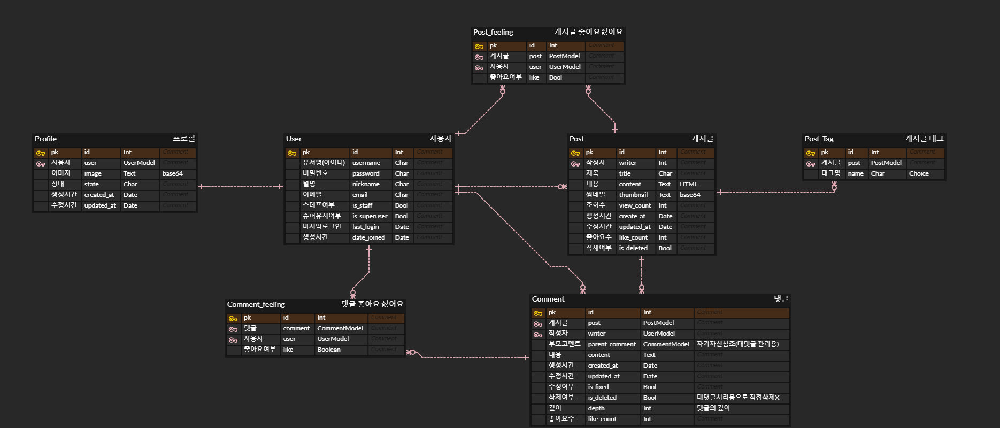

# Blog 만들기

## 개발환경 및 개발 기간

-   개발환경  
    Django4.2.3, HTML, CSS, JavaScript, sqlite

-   HTML, CSS 기반  
    [기반 레포](https://github.com/weniv/react-blog)

-   개발기간  
    2023년 7일 17일 ~ 2023년 7월 20일

## 구현된 기능
1. User : 회원가입, 로그인, 로그아웃, 회원탈퇴, 비밀번호변경
2. Profile : 사진, 상태를 프로필로 생성, 프로필 수정 기능
3. Post : 게시글 CRUD, 삭제된 게시글이나 User에 대해서 다른 화면으로 redirect
4. Comment : 게시글의 댓글의 작성, 삭제와 대댓글 기능.
5. Like : 게시글과 댓글에 대한 좋아요 기능.
6. Search : 카테고리에 대한 검색기능, 생성시간순, 생성시간역순으로 정렬기능
7. Pagination: Post에 대한 간단한 페이지네이션.

## 모델

## 세부 기능

로그아웃시 header에 로그인과 회원가입창이 표시됩니다.
이미 로그인 된 유저가 로그인창과 회원가입창에 접근하려고 하면, 이 페이지로 자동으로 연결됩니다.

회원가입 페이지는 Django의 UserCreationForm을 상속받아서 구현하였으며, 각 라인에 대한 에러를 표기해주도록 하였습니다.

로그인 페이지는 회원가입 페이지와 비슷하게 Django의 AuthenticationForm을 상속받아서 구현하였으며, 인증에 실패할시 에러를 하단에 표기하도록 하였습니다.

